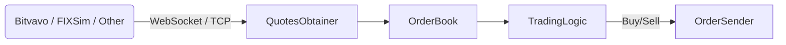

Got it — here’s the **raw Markdown text** (no code block wrapper).
You can now directly select, copy, and paste this straight into your `README.md` file in your editor.

---

# ⚡ Building a High-Frequency Trading System — An Experimental Journey

> This repository documents my exploration into building and optimizing a high-frequency trading (HFT) system from scratch — starting from a naive prototype and gradually evolving toward hardware-accelerated performance.
>
> It’s not about writing the fastest code right away. It’s about *learning what actually makes code fast* — by measuring, profiling, and experimenting at every layer of the stack.
>
> I’ll be following data, not dogma — if the results point in a different direction than planned, I’ll go there.

---

## 🧭 Motivation

The projects I’ve enjoyed most in my career were the ones where I had to **squeeze every last bit of performance out of the hardware** —
whether it was making **payment terminals** process transactions as fast as physically possible,
or getting the **brain of a self-driving robot** to run on a tiny **Arduino** with barely any resources.

That process — finding the limits of what hardware can do and bending them just a little further — is what I’ve always loved most.
This project is an extension of that passion: taking the same mindset and applying it to the extreme performance world of HFT.

---

## 🧩 Current Architecture (work-in-progress)

---

## 🧪 Phase 1 — Naive Implementation (Baseline)

> “First make it run.”

* Runs locally on macOS
* Focused purely on **functionality and structure**
* Uses standard STL containers (`std::vector`, `std::map`)
* Minimal threading, single market feed
* CLI visualization of order-book and trade flow
* Basic tick-to-trade latency logging

### 🎯 Goals

* Build a minimal but complete **end-to-end data flow**:
  **feed → order book → trading logic → simulated trade**
* Establish a baseline before optimizing anything
* Record first timing measurements (approximate but illustrative)

🧾 Reflection (to be filled after completion)

* What worked well in the architecture?
* Where did latency first appear?
* Did the system behave predictably under load?
* What surprised me?

---

## 🧰 Phase 2 — Dedicated Hardware Setup (Ubuntu Environment)

> “Before optimizing code, optimize your environment.”

Move immediately to **dedicated Linux hardware** for reproducible, controllable performance testing.

### 🖥️ Hardware Plan

* Linux workstation (Ubuntu)

    * Mellanox ConnectX-4/5 NIC
    * Low-latency tuned kernel
    * Fast NVMe + ample RAM
* BIOS / OS tuning

    * Disable C-states & hyper-threading
    * Fix CPU frequency
    * Configure IRQ affinity and `isolcpus`
* Software setup

    * `perf`, FlameGraph, Intel VTune
    * DPDK / AF_XDP (for later phases)
    * `taskset`, `numactl`, PTP for precise timestamps

### 🧭 Journey

* Researching and buying the hardware
* Kernel and BIOS tuning logs
* Baseline latency benchmarks on clean Ubuntu
* Automation scripts for repeatable experiments

🧾 Reflection (to be filled after completion)

* What configuration changes gave measurable differences?
* What setup challenges or unexpected bottlenecks appeared?
* How reproducible are the results compared to macOS?

---

## 🔍 Phase 3 — Profiling & First Optimizations

> “Let the profiler guide you, not your intuition.”

### Tools

`perf record`, `perf stat`, FlameGraphs, Intel VTune

### Experiments

* Swap STL containers for cache-optimized ones (`boost::unordered_flat_map`, `tsl::robin_map`)
* Reduce allocations (custom allocators / arena pools)
* Introduce **lock-free SPSC queues** between producer / consumer threads
* Optimize parsing pipeline (SIMD, pre-allocated buffers)
* Measure cost of synchronization (`std::mutex` vs atomics)

🧾 Reflection (to be filled after completion)

* Which profiler insights were most actionable?
* Did any “obvious” optimizations have no measurable effect?
* What patterns emerged across runs?

---

## 🧵 Phase 4 — Core-Level and Memory Optimizations

> “How close can I get to the metal on general-purpose CPUs?”

* Thread pinning with `taskset`
* NUMA-aware allocation (`numactl`, hugepages)
* Busy-wait vs epoll polling
* Pre-faulted memory, page coloring
* Cache-aligned structures / false-sharing elimination
* Custom per-thread allocators
* Branchless logic and `__builtin_expect` hints

🧾 Reflection (to be filled after completion)

* Which micro-optimizations scaled best?
* Did any introduce instability or regressions?
* How much lower is the tail latency now?

---

## 🧱 Phase 5 — Hardware Acceleration (FPGA Exploration)

> “When software hits the wall.”

* Simple Verilog feed parser for UDP packets
* DMA into host memory
* Compare FPGA vs CPU latency
* Hybrid setup: CPU order logic + FPGA feed handling

🧾 Reflection (to be filled after completion)

* What parts of the system map cleanly to hardware?
* What trade-offs appear between determinism and flexibility?
* How maintainable is the hardware pipeline?

---

## 📈 Progress Tracking (to be updated)

| Phase               | Avg Tick-to-Trade (µs) | 99th Percentile (µs) | Notes                       |
| :------------------ | ---------------------: | -------------------: | :-------------------------- |
| 1 – Naive           |                    TBD |                  TBD | macOS baseline              |
| 2 – Ubuntu baseline |                    TBD |                  TBD | Clean kernel setup          |
| 3 – Profiled        |                    TBD |                  TBD | First optimizations         |
| 4 – Core tuned      |                    TBD |                  TBD | Thread pinning / allocators |
| 5 – FPGA            |                    TBD |                  TBD | Hardware offload            |

---

## 🧰 Toolchain

* **C++20**, CMake, Conan
* **Profilers:** `perf`, FlameGraph, VTune
* **Libraries:** Boost, fmt, spdlog
* **Network Frameworks:** DPDK / AF_XDP
* **Hardware:** Mellanox NIC, DE10-Nano FPGA
* **Visualization:** CLI dashboard, Grafana metrics

---

## 📚 Learning Objectives

* Understand the full stack of low-latency systems
* Learn to measure rather than guess
* Build intuition for caches, NUMA, and scheduling
* Explore kernel-bypass networking
* Gain hands-on experience with hardware acceleration

---

## 🧩 Future Ideas (Data-Driven)

* Multi-exchange aggregation
* Adaptive batching strategies
* Risk throttling subsystem
* Microsecond-level timestamp correlation
* Cross-machine latency measurement

---

## 💬 Philosophy

> “Measure first, optimize second, automate third.”

This is an **open-ended experiment**, not a predefined tutorial.
The direction may change at any point if the data shows something unexpected — and that’s the fun of it.
